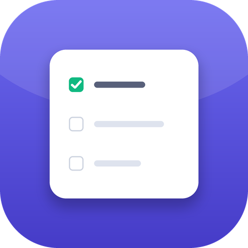
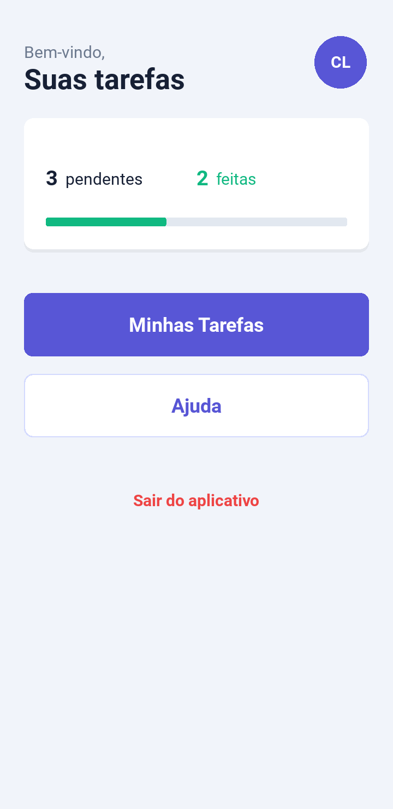
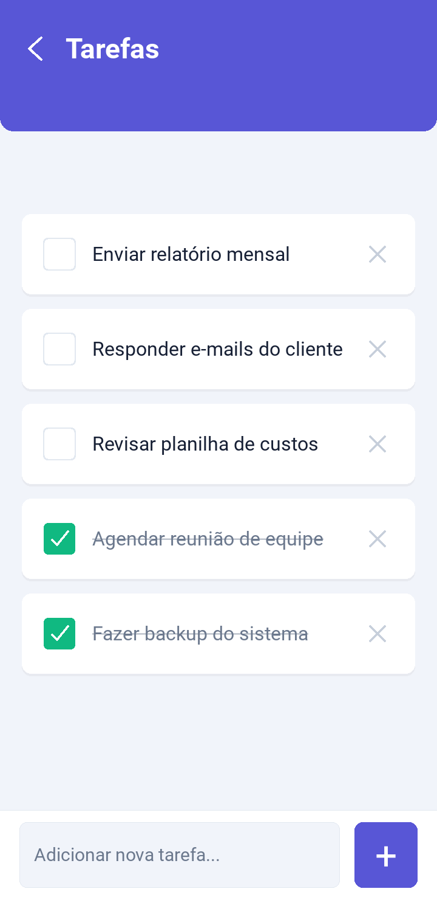
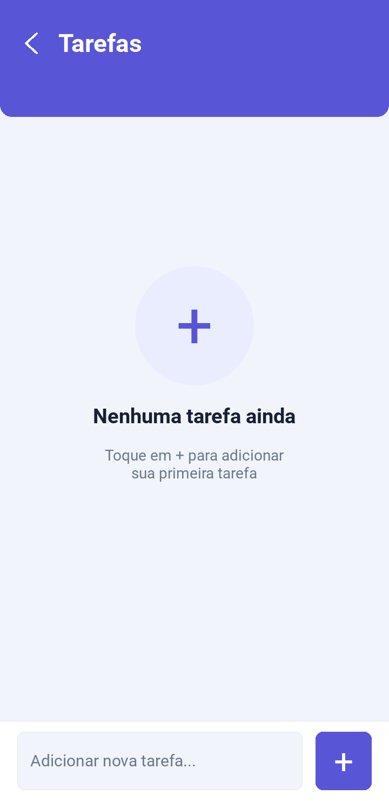
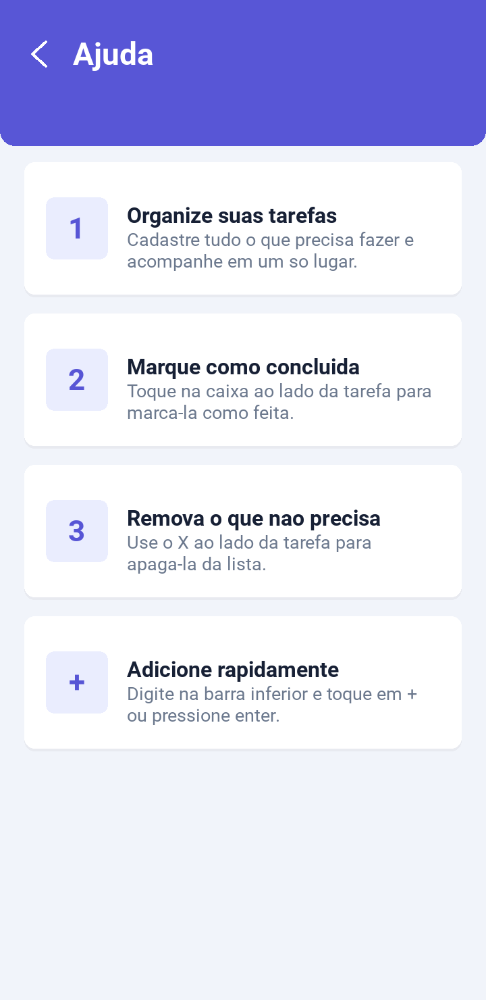
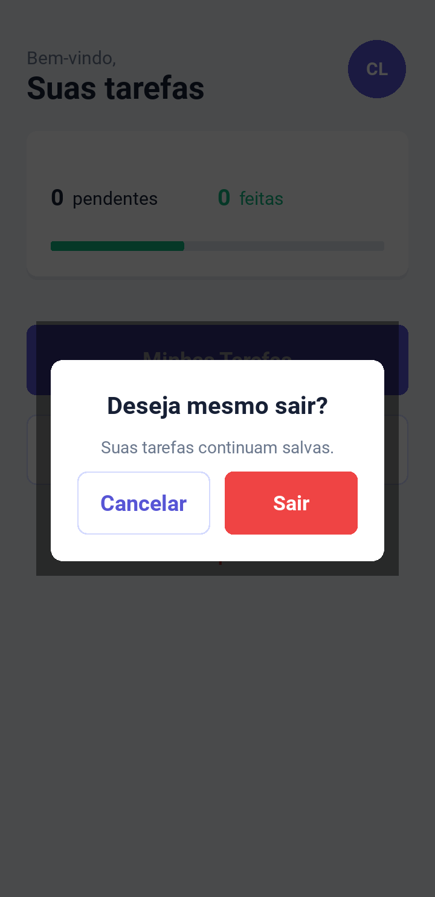

<p align="center">
  
</p>

<h1 align="center">Task App</h1>

<p align="center">
  Um aplicativo simples e bonito para organizar suas tarefas do dia a dia.<br>
  Feito em <b>Python</b> com <b>Kivy</b> e empacotado para <b>Android</b>.
</p>

<p align="center">
  
  
  
  
</p>

---

## 📖 Sobre o projeto

O **Task App** é um gerenciador de tarefas (to-do list) para celular. A proposta é
ser direto ao ponto: você cadastra o que precisa fazer, marca o que já concluiu e
acompanha seu progresso — tudo com uma interface limpa e moderna, e com os dados
salvos automaticamente no próprio aparelho.

## ✨ Funcionalidades

- ✅ **Adicionar tarefas** rapidamente pela barra inferior
- ✔️ **Marcar como concluída** — a tarefa fica verde e com o texto riscado
- 🗑️ **Remover tarefas** com um toque
- 📊 **Resumo de progresso** na tela inicial (pendentes × concluídas + barra)
- 💾 **Salvamento automático** — suas tarefas continuam lá ao reabrir o app
- 🪟 **Estado vazio** amigável quando não há nenhuma tarefa
- ❓ **Tela de ajuda** explicando o uso
- 🎨 Identidade visual coesa (paleta índigo/lavanda) e efeitos sonoros

## 📱 Telas

| Início | Tarefas | Lista vazia |
|:------:|:-------:|:-----------:|
|  |  |  |

| Ajuda | Sair |
|:-----:|:----:|
|  |  |

## 🔄 Como funciona

1. **Tela inicial** — mostra uma saudação e um resumo: quantas tarefas estão
   **pendentes**, quantas foram **concluídas** e uma barra de progresso.
2. Toque em **Minhas Tarefas** para abrir a lista.
3. Digite na **barra inferior** e toque em **+** (ou pressione Enter) para adicionar.
4. Toque na **caixinha** ao lado da tarefa para marcá-la como concluída
   (o texto fica riscado e a caixa fica verde). Toque de novo para desmarcar.
5. Toque no **✕** para remover a tarefa.
6. Tudo é salvo automaticamente em um arquivo `data.json` no diretório de dados do
   app, então a lista é recuperada na próxima abertura.
7. **Ajuda** explica o funcionamento e **Sair** pede uma confirmação antes de fechar.

## 🛠️ Tecnologias

- **[Python](https://www.python.org/)** 3.13
- **[Kivy](https://kivy.org/)** 2.3.1 — interface multiplataforma
- **KV language** — definição declarativa do layout e do estilo (`frontadmin.kv`)
- **[Buildozer](https://buildozer.readthedocs.io/)** — empacotamento do APK Android
- Persistência local simples em **JSON**

## 🚀 Como executar (no computador)

```bash
cd frontend

# cria e ativa um ambiente virtual
python -m venv .venv
source .venv/bin/activate        # Windows: .venv\Scripts\activate

# instala as dependências e roda
pip install "kivy[base]"
python main.py
```

## 🤖 Como gerar o APK (Android)

```bash
cd frontend
pip install buildozer
buildozer -v android debug
# o APK é gerado em frontend/bin/
```

As configurações de empacotamento (nome, ícone, splash, permissões) ficam no
arquivo [`frontend/buildozer.spec`](frontend/buildozer.spec).

## 📂 Estrutura do projeto

```
TaskAuxApp/
├── frontend/
│   ├── main.py              # Lógica: telas, navegação e persistência
│   ├── frontadmin.kv        # Layout e estilo (KV language)
│   ├── buildozer.spec       # Configuração do build Android
│   ├── requirements.txt
│   └── assets/
│       ├── images/          # Ícone, logo e splash
│       ├── audios/          # Efeitos sonoros (adicionar/remover)
│       └── fonts/           # Fontes
├── docs/
│   └── screenshots/         # Imagens usadas neste README
└── README.md
```

## 👤 Autor

Desenvolvido por **CL** (Lucas Duarte).

---

<p align="center"><i>Organize suas tarefas. ✓</i></p>
